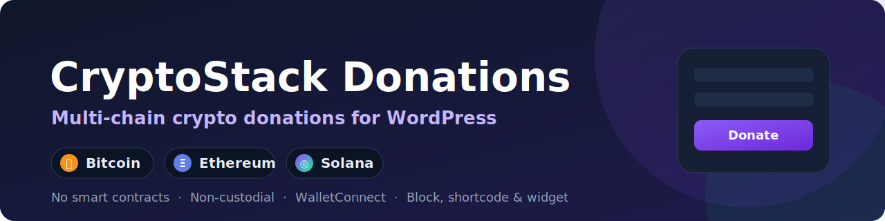
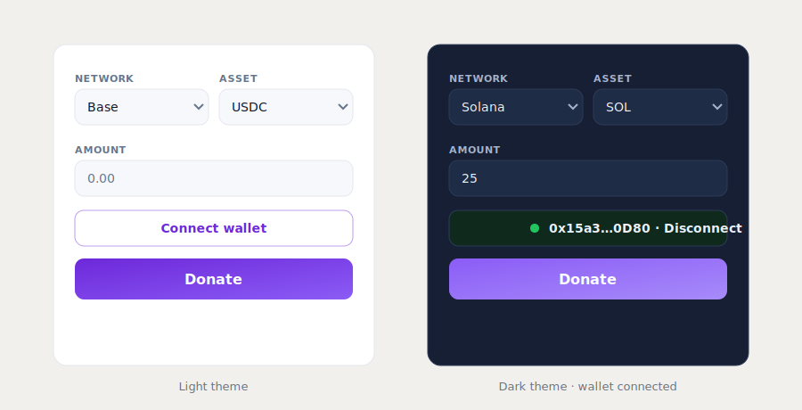

<p align="center">
  
</p>

<h1 align="center">CryptoStack Donations</h1>

<p align="center">
  <strong>Accept Bitcoin, Ethereum and Solana donations on WordPress with one WalletConnect button.</strong><br>
  Non-custodial · no smart contracts · a transparent 1% keeps the plugin free.
</p>

<p align="center">
  
  
  
  
  
</p>

---

CryptoStack Donations adds a modern **"Connect wallet"** donation button to any WordPress site. Visitors connect any WalletConnect-compatible wallet (via [Reown AppKit](https://reown.com/appkit)), pick a network and amount, and the donation goes **straight on-chain to the wallets you configure**. There is no account, no KYC, and no third-party processor — the plugin never holds funds.

<p align="center">
  
</p>

## ✨ Features

- **Three ecosystems, one button** — Bitcoin, Ethereum/EVM (Ethereum, Polygon, Base, BNB) and Solana.
- **No smart contracts** — nothing to deploy, audit, or pay gas to publish.
- **Non-custodial** — funds move from the donor's wallet directly to yours.
- **Anti-scam by design** — only native coins and a curated allow-list of stablecoins (USDC/USDT). Never calls token `approve`, never touches arbitrary contracts, never accepts unknown tokens.
- **Lockable settings** — wallet addresses lock automatically on save; unlocking takes an explicit, confirmed click.
- **Show it anywhere** — Gutenberg block, `[crypto_donate]` shortcode, or classic sidebar widget.
- **Themeable** — light / dark / auto, a custom accent color, and documented CSS variables for full control.
- **Privacy-friendly** — no analytics, no tracking, no external scripts loaded at runtime (the wallet SDK is bundled locally).

## 🔗 Supported networks & assets

| Network | Native | Stablecoins | Family |
| ------- | ------ | ----------- | ------ |
| Ethereum | ETH | USDC, USDT | EVM |
| Polygon | POL | USDC, USDT | EVM |
| Base | ETH | USDC | EVM |
| BNB Smart Chain | BNB | USDT | EVM |
| Solana | SOL | USDC, USDT | Solana |
| Bitcoin | BTC | — | Bitcoin |

A network only appears to donors when you provide a recipient address for it.

## 💸 How the 1% works without a smart contract

The fee is simply a second transfer in the same flow — it is fully visible to the donor in their wallet before they sign.

| Chain | Mechanism | Signatures |
| ----- | --------- | ---------- |
| **Solana** | One transaction, two transfer instructions (recipient + fee). | 1 |
| **EVM** | EIP-5792 `wallet_sendCalls` batches both transfers into one approval when the wallet supports it; otherwise two transactions. | 1–2 |
| **Bitcoin** | The donation and the fee are sent as two transactions. | 2 |

You choose whether the fee is **inclusive** (taken from the amount, recipient gets 99%) or **on top** (donor pays an extra 1%, recipient gets 100%).

## 🚀 Installation

### From the WordPress plugin directory
Once published: search for **CryptoStack Donations** under **Plugins → Add New**, install, and activate. *(Listing pending review.)*

### From a release `.zip`
1. Download the latest `cryptostack-donations.zip` from [Releases](https://github.com/Finland93/cryptostack-donations/releases).
2. In WordPress: **Plugins → Add New → Upload Plugin**, choose the zip, install, activate.

> The release zip ships with the wallet bundle pre-built — **no Node/CLI required** to install or use.

### From source
See [CONTRIBUTING.md](CONTRIBUTING.md) for the build steps (`npm install && npm run build`).

## ⚙️ Configuration

1. Go to **Settings → CryptoStack Donations**.
2. Create a free **Project ID** at [dashboard.reown.com](https://dashboard.reown.com) and paste it in.
3. **Add your site's domain to the project's allowed domains** in the Reown dashboard — wallet connections fail without this.
4. Enter the wallet address(es) you want to receive donations.
5. (Optional) Enable stablecoins, set a button label, theme, accent color, and fee mode.
6. Click **Save settings** — your addresses lock automatically.

## 🧩 Displaying the button

- **Block editor:** add the **Crypto Donation** block.
- **Shortcode:** `[crypto_donate]` or `[crypto_donate amount="25" label="Support us"]`.
- **Widget:** add the **Crypto Donation** widget to any sidebar.

## 🎨 Customization

Set a custom accent color in the settings, or override these CSS variables via **Appearance → Customize → Additional CSS**:

```css
.csd-widget {
  --csd-accent: #6d28d9;   /* buttons & highlights */
  --csd-accent-2: #8b5cf6; /* gradient end */
  --csd-bg: #ffffff;       /* card background */
  --csd-fg: #0f172a;       /* text */
  --csd-border: #e6e8ee;   /* borders */
  --csd-radius: 14px;      /* card corners */
}
```

Useful selectors: `.csd-card`, `.csd-donate-btn`, `.csd-wallet-btn`, `.csd-select`, `.csd-input`, `.csd-status--ok`, `.csd-status--err`.

## 🛡️ Security & anti-scam

- The engine only ever builds native transfers or `transfer` calls to your configured recipient / the hardcoded fee wallet for **allow-listed** tokens. No `approve`, no arbitrary contract calls.
- The donor reviews and signs **every** transaction in their own wallet.
- Wallet addresses lock on save; deleting the plugin wipes the stored addresses (including across a multisite network).
- See [SECURITY.md](SECURITY.md) to report a vulnerability.

## 🗺️ Roadmap

- [ ] Single-signature multi-output PSBT for Bitcoin (via `signPSBT`)
- [ ] Optional donation goals / progress bar
- [ ] More networks and tokens
- [ ] Per-block theme overrides

## 🤝 Contributing

Issues and pull requests are welcome — see [CONTRIBUTING.md](CONTRIBUTING.md) and the [Code of Conduct](CODE_OF_CONDUCT.md). Built and maintained by [@Finland93](https://github.com/Finland93).

## 📄 License

[GPL-2.0-or-later](LICENSE). You are free to use, study, modify, and share it. The bundled third-party libraries (Reown AppKit, Solana web3.js, ethers) retain their own compatible licenses.

## ⚠️ Disclaimer

This plugin is a tool for sending cryptocurrency transactions, provided "as is" without warranty. Accepting crypto donations may carry tax, accounting, and regulatory obligations that differ by country. It is **not** financial, legal, or tax advice. Always test with a small amount first.
